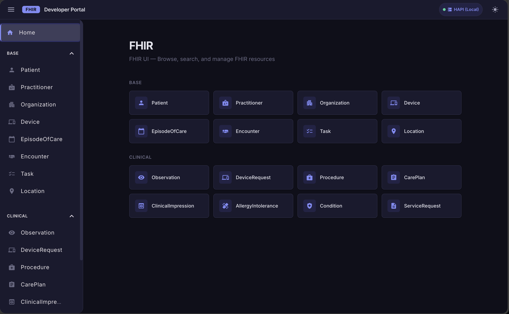
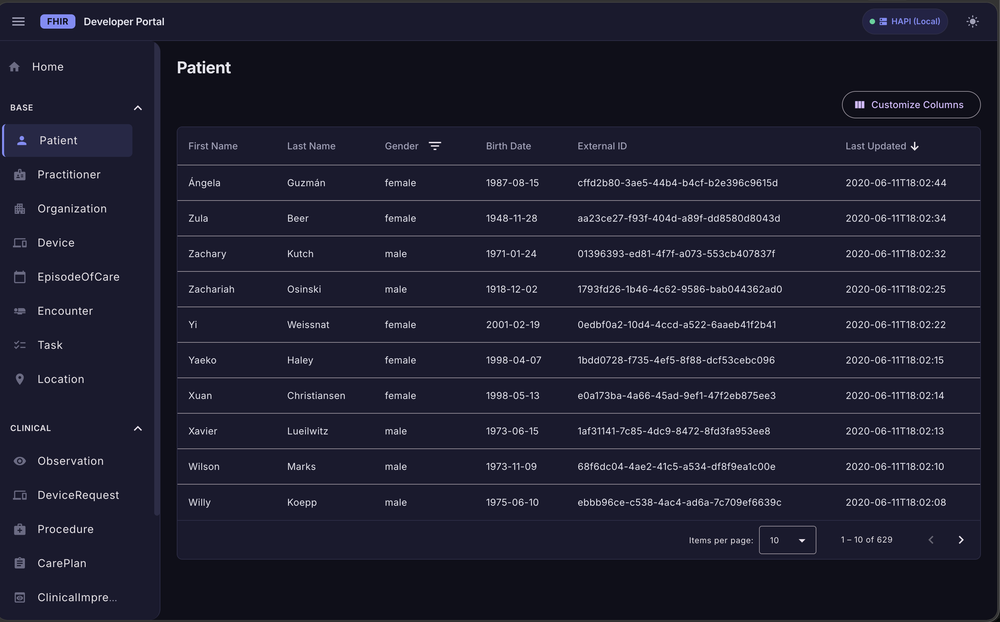
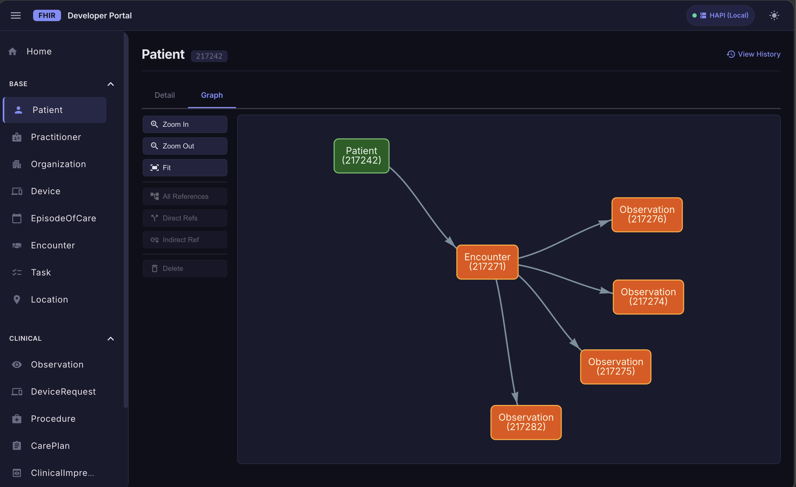
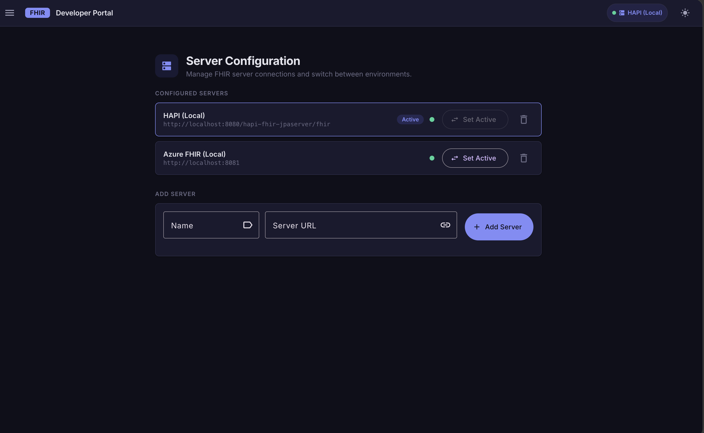

# FHIR UI

A modern Angular web application for browsing, searching, and managing [FHIR R4](https://hl7.org/fhir/R4/) resources.
Connect it to any FHIR-compliant server — the bundled Docker Compose brings up two local servers (HAPI with synthetic patient data and Azure Healthcare APIs) so you can start exploring immediately without any external dependencies.

## Screenshots

| Home — resource grid | Resource list |
|---|---|
|  |  |

| Resource detail & relationship graph | Server configuration |
|---|---|
|  |  |


## Features

- **Resource browser** — home page with cards grouped by category (Base, Clinical), each linking to a searchable list
- **Search & filter** — column-level filters, patient identifier search, and pagination across all resource types
- **Resource detail** — JSON viewer with syntax highlighting side-by-side with an interactive relationship graph (see below)
- **Edit resources** — in-place JSON editor for any FHIR resource
- **Version history** — full history timeline with per-version detail view
- **Server switching** — configure multiple FHIR servers, switch the active one at runtime, and see a live health indicator for each

## Resource relationship graph


Every resource detail page includes an interactive graph that maps the web of references around that resource. It is particularly useful for understanding how a `Patient` relates to their clinical data at a glance.

- **Directional edges** — arrows follow the direction of the FHIR reference, showing which resource points to which
- **Three reference modes** — toggle between *All References* (applies to Patient only), *Direct Refs* (resources this record links to), and *Indirect Refs* (resources that link back to it)
- **Pan, zoom, and fit** — standard graph controls keep large reference webs navigable
- **Clickable nodes** — clicking any node navigates to that resource's detail page

The graph is powered by [vis-network](https://visjs.github.io/vis-network/docs/network/) and loads lazily alongside the JSON detail panel.

## Prerequisites

- [Node.js](https://nodejs.org/) v18+
- [Docker](https://docs.docker.com/get-docker/) with the Compose plugin (for local FHIR servers)

## Quick start

### 1. Start the FHIR servers

The `docker-compose.yml` brings up two FHIR R4 servers:

```bash
./run-infra.sh
```

Pass `-f` to stop and remove all existing containers first:

```bash
./run-infra.sh -f
```

The script runs `docker compose up -d --wait`, so it blocks until every service is healthy.

#### What's inside

| Service | Image | Local port | Notes |
|---|---|---|---|
| **HAPI FHIR** | `smartonfhir/hapi-5:r4-synthea` | `8080` | Pre-loaded with [Synthea](https://synthea.mitre.org/) synthetic patients — ready to browse immediately |
| **Azure Healthcare APIs** | `mcr.microsoft.com/healthcareapis/r4-fhir-server` | `8081` | Empty server backed by SQL Server 2022; useful for testing writes on a clean store |
| **SQL Server 2022** | `mcr.microsoft.com/mssql/server:2022-latest` | `1431` | Internal dependency for the Azure server; not used directly |

### 2. Install dependencies and run the app

```bash
npm install
npm start
```

Open [http://localhost:4200](http://localhost:4200).

The app pre-configures both local servers and defaults to **HAPI (Local)**. To switch to the Azure server, go to **Settings → Server Configuration**, select **Azure FHIR (Local)**, and click **Set Active**.

## Supported resource types

**Base** — Patient, Practitioner, Organization, Device, DeviceRequest, EpisodeOfCare, Encounter, Task, Location

**Clinical** — Observation, Procedure, CarePlan, ClinicalImpression, AllergyIntolerance, Condition, ServiceRequest

## Development

| Command | What it does |
|---|---|
| `npm start` | Dev server at `http://localhost:4200` with live reload |
| `npm run build` | Production build → `dist/fhir-ui/` |
| `npm test` | Unit tests via Jest + Nx |
| `npm run test:coverage` | Tests with HTML coverage report |
| `ng generate component <name>` | Scaffold a new Angular component |

## Further reading

- [FHIR R4 specification](https://hl7.org/fhir/R4/)
- [HAPI FHIR server docs](https://hapifhir.io/)
- [Azure Healthcare APIs docs](https://learn.microsoft.com/en-us/azure/healthcare-apis/fhir/)
- [Angular CLI reference](https://angular.io/cli)
